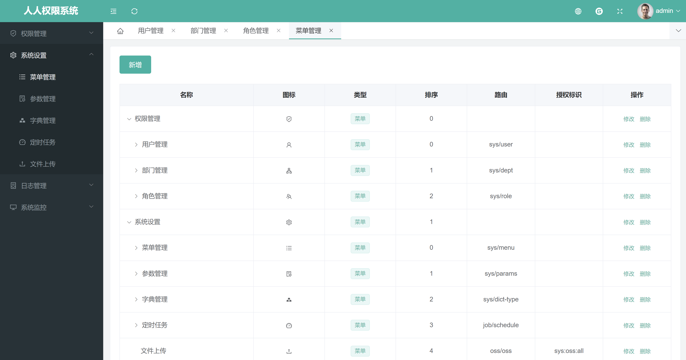

### 项目说明
- JAVA+unipp开发的chatgpt程序
- 开发脚手架基于人人开源 https://gitee.com/renrenio/renren-security
- chatgpt JAVASDK 基于Grt1228大佬开源的,地址https://github.com/Grt1228/chatgpt-java
- 完成了基本可商用功能包括APP双端,H5端,公众号,小程序的兼容,包括邀请返利,三级分销,微信,支付宝充值
    后台配置多KEY轮巡,热门问题,AI提问模型等

 

**本地部署**
- 通过git下载源码
- idea、eclipse需安装lombok插件，不然会提示找不到entity的get set方法
- 创建数据库renren_security，数据库编码为UTF-8
- 执行db/mysql.sql文件，初始化数据
- 修改application-dev.yml文件，更新MySQL账号和密码
- 在renren-security目录下，执行mvn clean install

 

 

 

